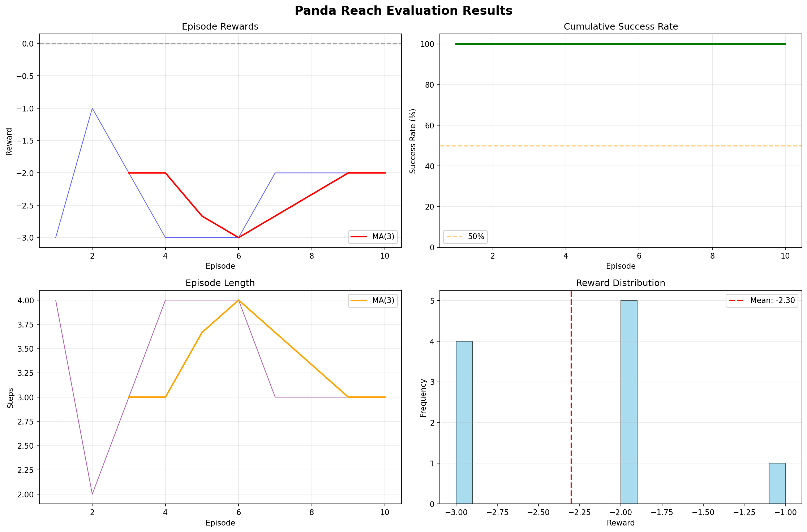

# handreach

A reinforcement learning implementation for training a Franka Emika Panda robot arm to reach target positions in 3D space using PPO.

## Overview

Custom PyBullet environment built on top of panda-gym with a reaching task. The agent learns to control a 7-DOF robotic arm to reach randomly positioned target spheres through deep reinforcement learning.

## Installation

```bash
pip install -r requirements.txt
```

## Usage

Train a new model:
```bash
python learn.py
```

Visualize trained model:
```bash
python show.py
```

## Results

Training was conducted over 300,000 steps with periodic checkpointing every 20,000 steps.




## Project Structure

```
├── envs/
│   ├── core.py              # Base environment implementation
│   ├── panda_tasks.py       # Task registration
│   ├── robots/
│   │   └── panda.py         # Panda robot model
│   └── tasks/
│       └── reach.py         # Reach task definition
├── learn.py                 # Training script
├── show.py                  # Visualization script
├── models/                  # Trained model checkpoints
├── logs/                    # TensorBoard logs and monitoring data
└── plots/                   # Training and evaluation plots
```

## Environment Details

**Observation Space**: Joint positions, velocities, end-effector pose, target position

**Action Space**: Continuous joint position deltas (7-dimensional)

**Reward**: Sparse reward based on distance to target with success bonus

**Episode Termination**: Success when end-effector reaches target within threshold

## Algorithm

Proximal Policy Optimization (PPO) with:
- Vectorized environments for parallel training
- Observation normalization
- Automatic checkpointing
- TensorBoard integration

## Performance

- Training steps: 300,000
- Checkpoint frequency: 20,000 steps
- Final models: `panda_reach_final.zip` and `vec_normalize_final.pkl`

## Dependencies

- gymnasium / gym
- pybullet
- stable-baselines3
- numpy
- tensorboard

## References

Built using [panda-gym](https://github.com/qgallouedec/panda-gym) as foundation.
