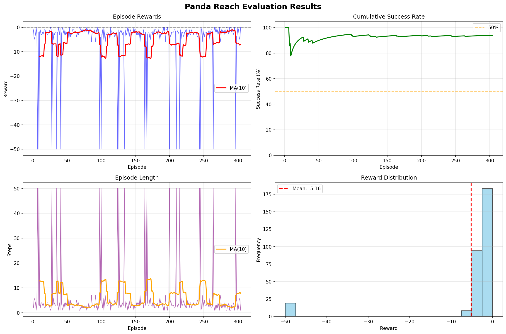

# handreach

Reinforcement learning for Franka Emika Panda robot reaching tasks using Proximal Policy Optimization.

## Installation

```bash
pip install -r requirements.txt
```

## Usage

Train the agent:
```bash
python learn.py
```

Evaluate and visualize:
```bash
python show.py
```

During evaluation, use keyboard controls:
- `Q` - quit
- `R` - reset episode

## Results




## Configuration

Training parameters in `learn.py`:

```python
ENV_NAME = "PandaReach-v3"
TOTAL_TIMESTEPS = 300_000
N_ENVS = 4                    # Parallel environments
MAX_EPISODE_STEPS = 50
TARGET_RANGE = 0.3
EVAL_FREQ = 5000
N_EVAL_EPISODES = 10
```

PPO hyperparameters:
```python
learning_rate = 3e-4
n_steps = 2048
batch_size = 64
n_epochs = 10
gamma = 0.99
gae_lambda = 0.95
```

## Architecture

```
├── envs/
│   ├── core.py              # Base environment implementation
│   ├── panda_tasks.py       # Task registration
│   ├── robots/
│   │   └── panda.py         # Panda robot kinematics
│   └── tasks/
│       └── reach.py         # Reach task definition
├── learn.py                 # Training pipeline with evaluation
├── show.py                  # Real-time visualization
├── models/                  # Model checkpoints (every 5000 steps)
├── logs/                    # TensorBoard logs and monitor data
└── plots/                   # Training and evaluation visualizations
```

## Environment

**Task**: Position end-effector at randomly spawned target within 0.3m radius

**Observation Space**: Joint positions, velocities, end-effector pose, target coordinates

**Action Space**: 7-dimensional continuous joint position deltas

**Reward**: Distance-based dense reward with success bonus

**Success Criterion**: End-effector within threshold distance of target

## Training Features

- Vectorized environments (4 parallel instances)
- Observation and reward normalization via VecNormalize
- Automatic checkpointing every 5000 steps
- TensorBoard logging for live monitoring
- Comprehensive evaluation with success rate tracking
- Multi-panel training visualization (rewards, episode length, distributions)

## Performance Tracking

Training generates four visualization panels:
- Episode rewards over time with moving average
- Episode length progression
- Reward distribution histogram
- Cumulative reward curve

Evaluation logs:
- Per-episode success/failure status
- Real-time success rate calculation
- FPS and step count monitoring

## Model Files

Saved models:
- `best_model.zip` - Best performing checkpoint
- `panda_reach_final.zip` - Final trained model
- `vec_normalize_final.pkl` - Observation normalization statistics
- `panda_reach_checkpoint_*_steps.zip` - Periodic checkpoints

## Alternative Algorithm

Code includes commented SAC implementation as alternative to PPO:

```python
model = SAC(
    "MultiInputPolicy",
    train_env,
    learning_rate=3e-4,
    buffer_size=1_000_000,
    batch_size=256,
    ...
)
```

## Dependencies

- gymnasium
- panda-gym
- pybullet
- stable-baselines3
- numpy
- opencv-python
- matplotlib
- pandas
- tensorboard

## References

Built on [panda-gym](https://github.com/qgallouedec/panda-gym) environment framework.
